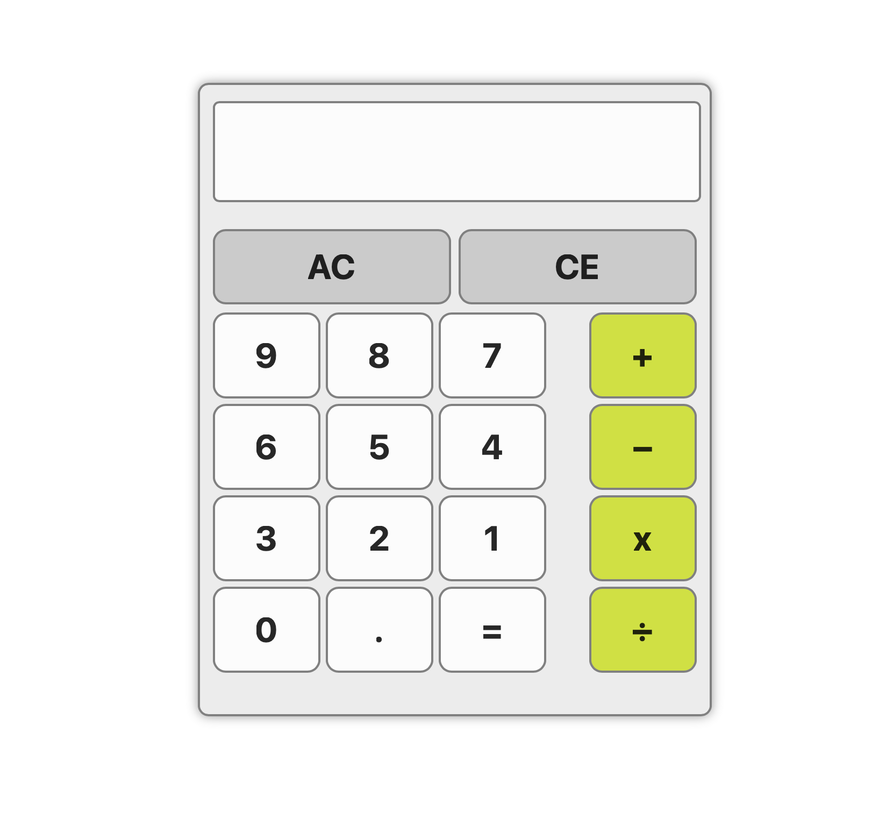

# Calculator

A clean, responsive web calculator built with vanilla JavaScript. Features a modern UI with smooth button animations and support for basic arithmetic operations.

Built as part of my full-stack development journey with [The Odin Project](https://www.theodinproject.com/).


<!-- Add your screenshot: take a screenshot and save it as screenshot.png in the project root -->

## Live Demo

[View Live Demo](https://theChosen-1.github.io/Calculator/)

## Features

- Basic arithmetic operations (add, subtract, multiply, divide)
- Decimal number support
- Expression chaining (e.g., 5 + 3 - 2)
- All Clear (AC) to reset the calculator
- Clear Entry (CE) to delete the last digit
- Division by zero error handling
- Responsive button hover and click animations

## Technologies

- HTML5
- CSS3 (Flexbox, transitions, hover effects)
- JavaScript (ES6+)

## Usage

1. Clone the repository:
   ```bash
   git clone https://github.com/inshaal81/Calculator.git
   ```

2. Open `index.html` in your browser

Or visit the live demo link above.

## License

MIT License - see [LICENSE](LICENSE) for details.


